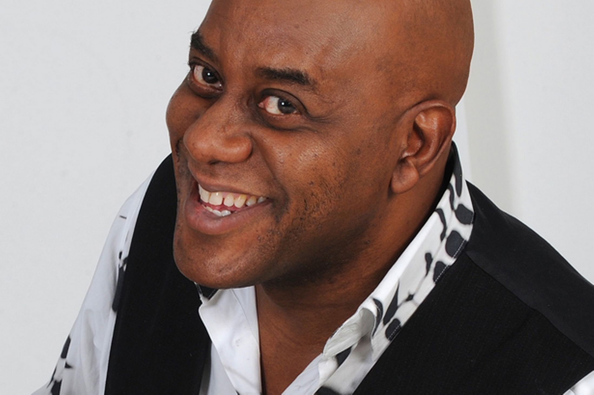

Brand Live Technical Documentation         
====

Brand Live Handbook
----

The majority of the technical documentation for this project is contained in a [handbook](https://docs.google.com/spreadsheet/ccc?key=0AmSovoaAS4VbdFVPUFUyTE55ekp5NXc2eFFNcHI0LUE&usp=sharing) in the form of a multi page [Google Spreadsheet](http://www.google.com/drive/apps.html). This provided a single point where everyone (including 3rd parties) could to access any information they might need. Rather than duplicating this information here, this document serves to give further detail on the [handbook](https://docs.google.com/spreadsheet/ccc?key=0AmSovoaAS4VbdFVPUFUyTE55ekp5NXc2eFFNcHI0LUE&usp=sharing), as well as supply technical information that it doesn't contain.

The areas this document will cover are:

  - Tools (hardware and software)
  - Advertising platforms 
  - Workflows / processes
  - Data storage and sharing within the team  

  
Tools
===
These can be separated into the following categories:

 - Hardware
 - Listening and analytics 
 - Data storage and sharing within the team
 - Editing assets / creative
 - Publishing output
 - Tracking performance

Hardware
----
All of the hardware used during the event (and which room it was located) is listed [on this page](https://docs.google.com/spreadsheet/ccc?key=0AmSovoaAS4VbdFVPUFUyTE55ekp5NXc2eFFNcHI0LUE&usp=drive_web#gid=2) of the handbook. We used 2 rooms during the live event:
 
 - Brand Live Room
 	- social listening
 	- concepting
 	- creative 
 	- discussion
 - Breakout room
 	- creating artwork
 	- editing and updating content
 	- pushing content live

 	
Listening and Analytics
----
We used a number of social listening and analytics tools during the live event to spot conversations we may get involved in and to monitor trends. After much research (around a week) we were unable to find any tools that would allow us to monitor trends *over the short period of the live event* (i.e. a few hours). Most tools would not update quickly enough (hours and days rather than minutes).

### Brand Live Room Screens

During the live event we had a bank of 8 large computer screens attached to a single computer running Windows. We could also configure an HD digital tv stream on 1 or 4 of the screens. Additionally we also had the capability to plug in VGA adaptors to share contents from individuals' laptops. The tools and feeds that were displayed on the screens is on [this page](https://docs.google.com/spreadsheet/ccc?key=0AmSovoaAS4VbdFVPUFUyTE55ekp5NXc2eFFNcHI0LUE&usp=drive_web#gid=9) of the handbook.

### Additional Tools

As well as the tools visible on the screens our social team used other software and tools. The full list of tools we audited can be found [here](https://docs.google.com/spreadsheet/ccc?key=0AmSovoaAS4VbdFVPUFUyTE55ekp5NXc2eFFNcHI0LUE&usp=sharing). 

The tools we used are:

 - Sysomos
 - Hootsuite
 - TrendsMap
 - Tweetdeck

Data storage and sharing
----
All data for this campaign was stored in a folder on [Google Drive](https://drive.google.com). Individuals were given the relevant viewing and editing permissions. 
Benefits of using Google Drive:

 - instant sync on all machines an platforms
 - no additional software required
 - a single link shared all assets
 - secure
 - versioned storage

 The types of data stored on Google Drive include:

  - Visual / video / fonts / graphics
  - All documentation (including the handbook)

Editing assets / creative
----
We used the standard Adobe CS applications to edit media then uploaded to the Flite platform (see Advertising Platforms below).

Advertising Platforms
----
Normally P&G would use Mediamind for OLA. This event required the ability to update content and for these changes to be reflected immediately in the ads that were served. For this reason we used the [Flite Platform](https://www.flite.com/).

#### Benefits of the Flite Platform
 - update ads in realtime
 - change weightinug of multiple creatives in realtime
 - monitor key metrics in realtime
 - in-browser creation and editing of banners (no development required - a designer could create and edit banners in a web browser, thus reducing the work-chain)
 - realtime support from their technical team over the weekend during the live event

#### Contacts at Flite 
Our key contact was [Minnie Fontes](minnie@flite.com). We also had a number of other contacts on the accounts and technical team.

#### Ad-serving format
All dynamic ads were served as Flash banners. This was dictated by the space that Starcom bought for this campaign. All of these banners were hosted on the [ITV website](http://www.itv.com).

Workflows & Processes
----

The key objective of the event was to create dynamic OLA during the live event and over the course of the weekend. The process for this is detailed in the diagram below

  